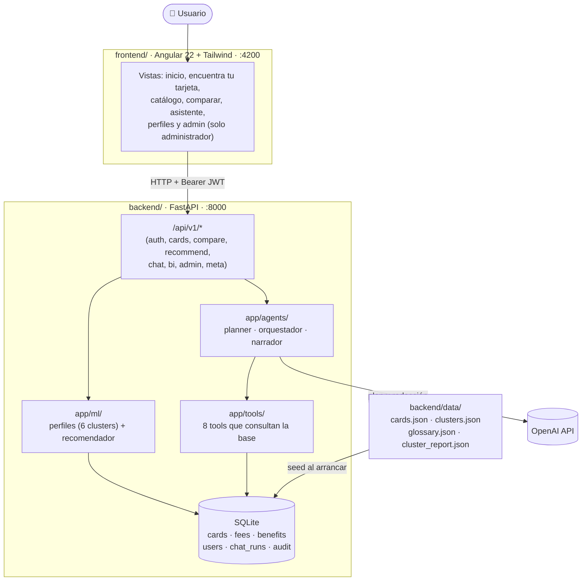
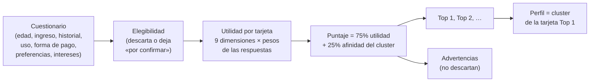
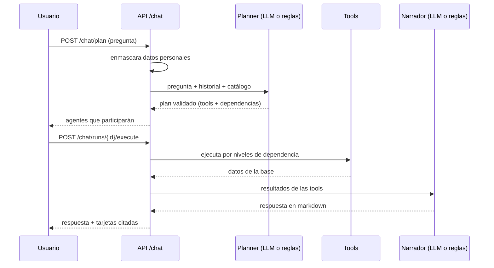
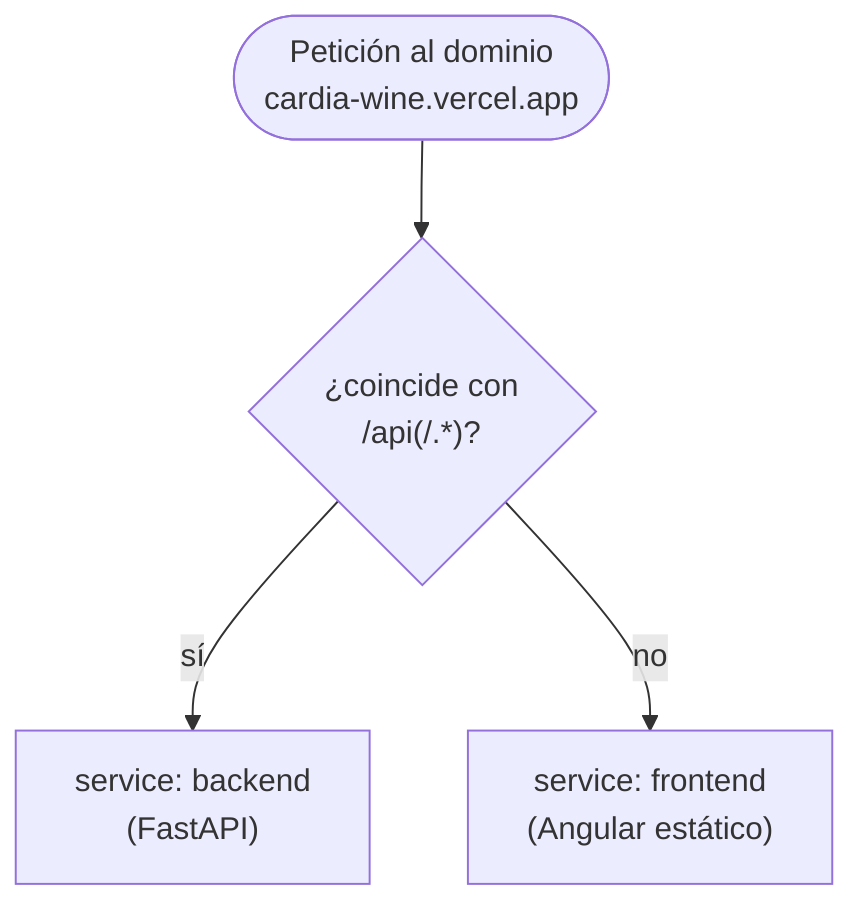

# CardIA

Plataforma de **educación financiera sobre tarjetas de crédito en México**. Responde tres preguntas sobre cualquier tarjeta del mercado:

1. **¿Qué tarjetas hay y cómo son?** Catálogo visual con requisitos, beneficios, desglose de comisiones y un comparador de 2 a 4 tarjetas.
2. **¿Cómo funciona una tarjeta?** Un asistente con IA (LLM + tools + agentes) explica pago mínimo, pago para no generar intereses, CAT y más, consultando siempre los datos de la base.
3. **¿Cuál es la mejor para mí?** Un cuestionario corto ubica al usuario en un **perfil** (cluster de tarjetas) y le entrega un Top de tarjetas con sus advertencias.

> ⚠️ **CardIA es una herramienta de educación financiera, no un asesor financiero.** No está afiliada a ninguna institución financiera, no garantiza la aprobación de ningún crédito y nunca pide datos personales. Todo número de una tarjeta proviene de la base de datos, nunca del LLM.

**En línea:** <https://cardia-wine.vercel.app>

---

## Índice

- [Arquitectura](#arquitectura)
- [Datos](#datos)
- [Backend (FastAPI)](#backend-fastapi)
  - [Perfiles y recomendador](#perfiles-y-recomendador)
  - [Asistente con agentes y OpenAI](#asistente-con-agentes-y-openai)
  - [API REST](#api-rest)
- [Frontend (Angular)](#frontend-angular)
- [Correr todo en desarrollo](#correr-todo-en-desarrollo)
- [Calidad: tests, lint y contratos](#calidad-tests-lint-y-contratos)
- [Despliegue en Vercel](#despliegue-en-vercel)
- [Variables de entorno](#variables-de-entorno)
- [Estructura del repositorio](#estructura-del-repositorio)
- [Decisiones y límites](#decisiones-y-límites)

---

## Arquitectura

Monorepo con un **frontend** Angular y un **backend** FastAPI. El backend consulta una base SQLite sembrada desde el Excel de tarjetas, ejecuta el recomendador (perfiles por clustering) y orquesta el asistente con el SDK oficial de OpenAI.



En producción (Vercel) ambos servicios viven bajo el mismo dominio; ver [Despliegue en Vercel](#despliegue-en-vercel).

---

## Datos

| Fuente | Contenido |
|---|---|
| `datos_consolidados/tarjetas.xlsx` | 69 tarjetas (hojas `Tarjetas`, `Requisitos`, `Comisiones`, `Beneficios`, `Instituciones`, `dataset_tarjetas_ingenieria`), compilado propio de Banxico y CONDUSEF. Todo se relaciona por `ID_Tarjeta`. La columna `Cluster` (0 a 5) es el resultado del modelo de clustering. |
| `imagenes_tarjetas/` | Imagen original de cada tarjeta (nombre = `Nombre de la tarjeta`). |
| `perfilamiento_clusters.docx` | Descripción completa de los 6 clusters. |
| `datos/` (no versionado) | Fuentes crudas (PDF, CONDUSEF, Banxico, ERCO). |

**El backend nunca lee el Excel en tiempo de request.** Un proceso de datos lo convierte en artefactos de solo lectura:

```bash
make images   # imagenes_tarjetas/ -> frontend/public/cards/<ID>.webp (lienzo 560x353 transparente) + backend/data/images.json
make data     # Excel -> backend/data/cards.json (tarjetas, comisiones, beneficios, URL del banco, cluster, variables del modelo)
```

Al arrancar, la API siembra SQLite desde `cards.json` de forma **idempotente y versionada**: si cambia el `generated_at` del JSON se recrean solo las tablas estáticas (tarjetas, comisiones y beneficios); usuarios y trazas no se tocan.

---

## Backend (FastAPI)

```bash
cd backend
uv sync
uv run uvicorn app.main:app --reload --port 8000
```

- Documentación interactiva: <http://localhost:8000/docs> · OpenAPI: `/openapi.json`.
- Salud del servicio: `GET /api/v1/meta/health` (indica si el LLM está activo; nunca expone claves).
- Tests: `uv run pytest -q` (sin red: OpenAI se reemplaza por un cliente falso).
- Stack: Python 3.12 · FastAPI · Pydantic v2 · SQLAlchemy 2 async + aiosqlite · PyJWT + argon2 · SDK `openai`.

### Perfiles y recomendador

Los **6 perfiles** son los clusters de tarjetas (clustering jerárquico Ward sobre 59 variables reducidas a 12 componentes). Sus nombres y textos viven en `backend/data/clusters.json`.

| Cluster | Nombre | Qué lo define |
|---|---|---|
| 0 | Historial sólido | Score cercano a 700 y 12 meses de antigüedad; descuentos amplios |
| 1 | Costo bajo | Anualidad más baja, ingreso mínimo accesible |
| 2 | Viajes y recompensas | Puntos por dólar, MSI de viaje y preventas |
| 3 | Promociones | Mayor variedad de beneficios, sin pedir score, CAT más alto |
| 4 | Comisiones en pesos | Pocos beneficios y comisiones fijas altas |
| 5 | Tasa baja | Menor tasa y CAT, con anualidad alta |

`recommend(profile)` (`app/ml/recommender.py`) es determinista y explicable:



- **9 dimensiones** por tarjeta (escala 0–1, percentiles 5–95): anualidad, tasa, comisiones, puntos, viaje, promociones, MSI, transferencia de saldo y requisitos accesibles.
- Los **pesos** salen de las respuestas (p. ej. evitar anualidad pesa 6.0 y multiplica ×0.75 a las tarjetas con anualidad; quien financia pesa más la tasa; cada interés elegido suma peso a su dimensión).
- **Advertencias** (informan, no descartan): contradicen lo que el usuario pidió, tasa o CAT altos si no paga el total, beneficios buscados que no ofrece.
- La vista **Perfiles** (solo administrador) documenta este método y el análisis completo de cada cluster.

### Asistente con agentes y OpenAI

El orquestador **genera y persiste un plan explícito** de tool calls con dependencias *antes* de ejecutarlo (queda en BD para trazabilidad del administrador). Al usuario final solo se le muestran puntitos de color de los agentes que responden.



| Agente | Responsabilidad | Tools |
|---|---|---|
| `FundamentalsAgent` | Información de tarjetas de la base | `search_cards`, `get_card_details`, `compare_cards` |
| `ComisionesAgent` | Desglose de comisiones e impacto | `get_card_fees` |
| `EducativeAgent` | Conceptos de TDC (inclusión financiera) | `get_education_topic`, `search_glossary` (glosario CONDUSEF, 58 términos) |
| `PerfilAgent` | Interpreta los perfiles | `explain_profiles`, `get_card_profile` |

- **El LLM nunca calcula ni inventa datos de tarjetas:** todo dato viene de una tool; el cluster y las recomendaciones, del recomendador.
- **OpenAI (Responses API):** el planner usa *structured outputs* (Pydantic) y se valida contra el registro de tools y el catálogo; el narrador redacta con `verbosity` medio y `reasoning` bajo. Modelo por defecto: `gpt-5.4-mini` (configurable).
- **Respaldo automático:** sin clave, o ante cualquier error de OpenAI, el asistente usa planner y narrador por reglas con las mismas tools; el usuario no ve el fallo.
- **Privacidad:** `app/core/privacy.py` oculta RFC, CURP, números de tarjeta, correos y teléfonos antes de guardar o enviar el mensaje al LLM.
- `POST /chat/ask` hace plan + ejecución en una sola petición (respaldo en serverless, donde dos peticiones pueden caer en instancias distintas).

### API REST

Prefijo `/api/v1`. Todo requiere `Authorization: Bearer <token>` excepto `meta/*` y `auth/login`.

| Método | Ruta | Descripción |
|---|---|---|
| GET | `/meta/health`, `/meta/disclaimer` | Estado y aviso |
| POST | `/auth/login` · GET `/auth/me` · POST `/auth/logout` | Sesión (JWT) |
| GET | `/cards`, `/cards/facets`, `/cards/{id}` | Catálogo, filtros y detalle |
| POST | `/compare` | Compara 2 a 4 tarjetas |
| POST | `/recommend` | Perfil + Top de tarjetas |
| GET | `/chat/topics` | Temas para aprender (glosario) |
| POST | `/chat/plan` · `/chat/runs/{id}/execute` · `/chat/ask` | Asistente |
| GET | `/chat/runs`, `/chat/runs/{id}` | Historial |
| GET | `/bi` | Perfiles y documentación (**admin**) |
| GET | `/admin/{overview,events,chat-runs,users}` | Trazabilidad (**admin**) |

Usuarios semilla locales: `admin@cardia.local / admin1234` y `demo@cardia.local / demo1234` (en producción se definen por variables de entorno).

---

## Frontend (Angular)

```bash
cd frontend
npm install
npm start          # http://localhost:4200 (proxy /api -> :8000)
```

Angular 22 con **solo componentes standalone y signals**, Tailwind CSS 4 y un único archivo de estilos con los tokens del sistema de diseño (`src/styles.css`). Los gráficos son SVG propios (sin librerías de gráficas).

| Vista | Ruta | Acceso |
|---|---|---|
| Inicio | `/` | Usuario |
| Encuentra tu tarjeta | `/encuentra-tu-tarjeta` | Usuario |
| Catálogo y detalle | `/tarjetas`, `/tarjetas/:id` | Usuario |
| Comparar | `/comparar` | Usuario |
| Asistente | `/asistente` | Usuario |
| Perfiles | `/perfiles` | **Administrador** |
| Administración | `/admin` | **Administrador** |
| Inicio de sesión | `/login` | Público |

- Los **tipos de la API se generan** desde `/openapi.json` (`make contracts` → `src/app/core/api/schema.d.ts`); no se escriben a mano.
- Los *guards* devuelven `UrlTree` (nunca `false`) para no dejar pantallas en blanco; el interceptor agrega el Bearer y cierra sesión ante un 401.
- Cada vista tiene estados de carga, error y vacío. El historial del chat y la selección de comparación se guardan en `localStorage`.

---

## Correr todo en desarrollo

Requisitos: Python 3.12, `uv`, Node 24 LTS y `make`.

```bash
cp .env.example .env     # opcional; agrega OPENAI_API_KEY para activar el LLM
make setup               # dependencias de backend y frontend
make dev                 # API :8000 + UI :4200
```

Si cambias el `.env` hay que **reiniciar el backend** (y su proceso hijo de `--reload`): la configuración se lee una sola vez.

| Comando | Qué hace |
|---|---|
| `make images` / `make data` | Imágenes y Excel → artefactos (ver [Datos](#datos)) |
| `make seed` | Esquema y datos en SQLite |
| `make test` | pytest + vitest |
| `make lint` / `make format` | ruff + tsc / formateo |
| `make contracts` | OpenAPI → tipos de TypeScript |
| `make build` | Build de producción del frontend |

---

## Calidad: tests, lint y contratos

- **31 tests de backend** (pytest, sin red): ETL y normalización, recomendador, tools, planner, API completa, privacidad y capa LLM con cliente falso. **3 tests de frontend** (vitest).
- Un test reproduce las cifras de `perfilamiento_clusters.docx` (tamaño, CAT y anualidad promedio por cluster) desde los datos cargados.
- `ruff` (backend) y `tsc` (frontend) sin errores. Semilla fija en todo el ML.

---

## Despliegue en Vercel

`vercel.json` (raíz) usa la función [Services](https://vercel.com/docs/services) de Vercel para desplegar frontend y backend como **un solo proyecto y un solo dominio**:

```json
{
  "services": {
    "frontend": { "root": "frontend", "framework": "angular" },
    "backend": { "root": "backend", "framework": "fastapi", "entrypoint": "app.main:app" }
  },
  "rewrites": [
    { "source": "/api(/.*)?", "destination": { "service": "backend" } },
    { "source": "/(.*)", "destination": { "service": "frontend" } }
  ]
}
```

Las `rewrites` se evalúan en orden; la primera que coincide decide el destino:



- El backend recibe la ruta original (`/api/v1/...`), igual que en local.
- El frontend usa rutas relativas (`/api/v1`), así que **no necesita variables de entorno** ni CORS.
- **SQLite es efímero en Vercel** (decisión D1): se crea en `/tmp` y se re-siembra en cada arranque en frío; los usuarios, trazas y planes de chat se pierden al reiniciar. El historial del chat también vive en el navegador.
- En producción el backend **se niega a arrancar** si `JWT_SECRET` falta o es corto (< 32 caracteres).

---

## Variables de entorno

Copia `.env.example` a `.env` (local) o defínelas en *Project Settings → Environment Variables* de Vercel. **Nunca** subas `.env` al repositorio.

| Variable | Uso |
|---|---|
| `OPENAI_API_KEY` | Activa el LLM (sin ella, el asistente usa reglas) |
| `JWT_SECRET` | **Obligatoria en producción**, 32+ caracteres |
| `SEED_ADMIN_PASSWORD`, `SEED_DEMO_PASSWORD` | Contraseñas de las cuentas semilla |
| `LLM_MODEL`, `LLM_MODEL_FAST` | Por defecto `gpt-5.4-mini` |
| `LLM_REASONING_EFFORT`, `LLM_VERBOSITY` | `low` y `medium` por defecto |
| `DATABASE_URL` | SQLite local; en Vercel usa `/tmp` automáticamente |

---

## Estructura del repositorio

```
CardIA/
├── vercel.json              # Services: frontend + backend en un dominio
├── Makefile · .env.example · AGENTS.md
├── backend/
│   ├── app/{api/v1, agents, tools, domain, ml, services, schemas, db, core}
│   ├── data/                # cards.json, clusters.json, glossary.json, cluster_report.json, images.json
│   ├── scripts/             # build_data, build_images, build_cluster_report, dump_openapi
│   └── tests/
├── frontend/src/app/{core, shared, features, viz}
├── datos_consolidados/      # tarjetas.xlsx (fuente versionada)
├── imagenes_tarjetas/       # imágenes originales
└── docs/                    # documentación del proyecto
```

- `backend/app/api/v1/` — cada endpoint nuevo es un módulo que se registra en `__init__.py`.
- `backend/app/tools/registry.py` — cada tool declara su agente, su descripción y su JSON Schema (compatible con tool calling de OpenAI).
- `frontend/src/app/features/` — cada pantalla es una carpeta; se registra en `app.routes.ts` y, si va en el menú, en `shared/shell.ts`.

---

## Decisiones y límites

Las convenciones, decisiones (D1–D13) y trampas verificadas están en [`AGENTS.md`](AGENTS.md). Fuera de alcance por diseño: scraping, conexión con instituciones financieras, ejecución de operaciones, datos personales sensibles y cualquier sugerencia de contratar un producto. El enlace «Aplica ahora» lleva siempre al sitio general de la institución, nunca a una URL de producto.
